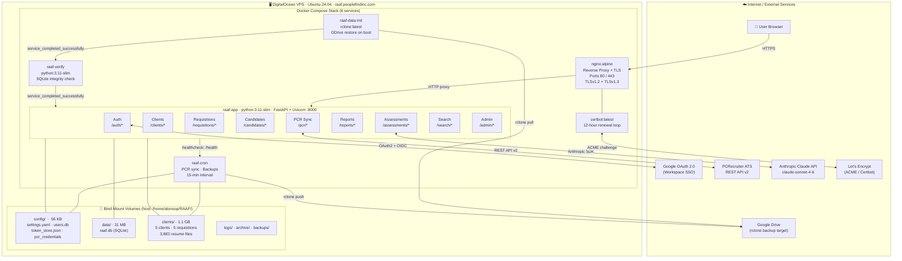

# RAAF — Technical Architecture

**Resume Assessment Automation Framework**
Archtekt Consulting Inc. · `raaf.peoplefindinc.com`

---

## System Diagram



---

## Codebase Statistics

| Metric | Count |
|--------|-------|
| Python source files | 74 |
| Python lines of code | 18,520 |
| HTML templates (Jinja2) | 42 |
| HTML lines | 8,126 |
| JavaScript files | 2 |
| JavaScript lines | 938 |
| YAML config files | 15 |
| Shell scripts | 8 |
| **Total LOC** | **~27,600** |

| Module Area | Files |
|-------------|-------|
| Web routers (`web/routers/`) | 11 |
| Automation scripts (`scripts/`) | 48 |
| PCR integration scripts (`scripts/pcr/`) | 11 |
| API endpoints (FastAPI routes) | 107 |

---

## Tech Stack

### Backend
| Component | Technology |
|-----------|-----------|
| Language | Python 3.11 |
| Web framework | FastAPI 0.109–0.115 |
| ASGI server | Uvicorn |
| Template engine | Jinja2 3.1.x |
| ORM / DB | SQLAlchemy 2.0 + SQLite |
| Auth middleware | Starlette SessionMiddleware + itsdangerous |
| OAuth client | Authlib 1.3 (Google OIDC) |
| Password hashing | bcrypt |
| HTTP client | httpx (async) |
| PDF parsing | pdfplumber + PyMuPDF |
| DOCX parsing | python-docx |
| Data aggregation | pandas |
| Configuration | PyYAML |
| Encryption | cryptography (Fernet — token store) |

### Frontend
| Component | Technology |
|-----------|-----------|
| UI | Jinja2 server-rendered HTML |
| Report generation | Node.js + docx (npm) |
| Styling | Custom CSS (static assets) |

### Infrastructure
| Component | Technology |
|-----------|-----------|
| Containerisation | Docker Compose (6 services) |
| Reverse proxy | nginx:alpine — TLSv1.2/1.3 |
| TLS certificates | Let's Encrypt via certbot (auto-renew 12h) |
| VPS | DigitalOcean — Ubuntu 24.04 |
| File sync | rclone (Google Drive ↔ VPS) |

---

## Database

**Engine:** SQLite (`data/raaf.db`) — **31 MB**

| Table | Purpose |
|-------|---------|
| `clients` | Company metadata, billing, status |
| `client_contacts` | Per-client contact directory |
| `requisitions` | Job openings, frameworks, thresholds |
| `candidates` | Candidate records per requisition |
| `assessments` | AI scores, breakdowns, recommendations |
| `batches` | Batch groupings of candidate assessments |
| `reports` | Report file tracking and metadata |
| `pcr_positions_cache` | Cached PCRecruiter position data |
| `users` | Local email/password auth accounts |
| `schema_version` | DB migration version tracking |

**Storage mode** controlled by `RAAF_DB_MODE` env var:
- `db` — SQLite only (production default)
- `dual` — SQLite + YAML files simultaneously (migration mode)
- `files` — YAML/JSON only (legacy fallback)

---

## External API Integrations

### Anthropic Claude API
- **Model:** `claude-sonnet-4-6`
- **SDK:** `anthropic>=0.40.0` (Python)
- **Usage:** Structured resume scoring against job-specific frameworks
- **Config:** max 8,192 tokens · temperature 0.1 · 120s timeout
- **Invoked by:** `scripts/assess_candidate.py` and the `/assessments/*` router

### Google OAuth 2.0 / OIDC
- **Library:** Authlib 1.3 (`authlib.integrations.starlette_client`)
- **Scopes:** `openid`, `email`, `profile`, `drive.readonly`
- **Flow:** Authorization Code with PKCE state via Starlette SessionMiddleware
- **Token storage:** Fernet-encrypted JSON file (`config/.token_store.json`)
- **Access control:** Allowlist by email address (`config/settings.yaml`)
- **Refresh:** `/auth/refresh-token` endpoint via httpx

### PCRecruiter ATS (REST API v2)
- **Base URL:** `https://www2.pcrecruiter.net/rest/api`
- **Auth:** Session token (60-min TTL, auto-refreshed)
- **Operations:** Pull positions, sync candidates, download resumes, push scores, update pipeline status
- **Sync interval:** 15 minutes (raaf-cron)
- **Scripts:** 11 dedicated scripts in `scripts/pcr/`

### Google Drive (rclone)
- **Remote:** `raaf-backup:RAAF-Backups`
- **Pull:** `raaf-data-init` restores latest backup on every container start
- **Push:** `raaf-cron` pushes incremental backups on schedule
- **Auth:** rclone config mounted from host (`~/.config/rclone`)

---

## Service Startup Chain

```
raaf-data-init  ──► raaf-verify  ──► raaf-app  ──► raaf-cron
  (rclone          (SQLite            (FastAPI        (PCR sync
  GDrive pull)     integrity)         web server)     + backups)

nginx + certbot run independently (no app dependency)
```

---

## Authentication Flow

```
Browser → GET /auth/login/google
       → Authlib builds Google authorization URL (state stored in session cookie)
       → Browser redirected to accounts.google.com
       → User authenticates + consents
       → Google redirects to /auth/callback?code=...&state=...
       → Authlib validates state, exchanges code for tokens
       → ID token decoded → user_info (email, name, picture)
       → Email checked against allowlist (settings.yaml)
       → Session token created (itsdangerous signed, 8h TTL)
       → OAuth tokens Fernet-encrypted → config/.token_store.json
       → Secure session cookie set → redirect to /
```

---

## Data Layout (Live)

```
/home/alonsop/RAAF/
├── data/           31 MB   raaf.db (SQLite — all structured metadata)
├── clients/         1.1 GB  5 clients · 5 requisitions · 3,883 resume files
│   └── {client}/
│       └── requisitions/{req_id}/
│           ├── resumes/batches/{batch}/   raw PDFs + extracted text
│           ├── assessments/individual/    per-candidate JSON scores
│           └── reports/                  final DOCX/PDF deliverables
├── config/          56 KB   settings · credentials · token store · users.db
├── logs/                    rotating app logs (10 MB/file, 5 backups)
├── archive/                 completed/closed requisitions
└── backups/                 local backup snapshots (before GDrive push)
```
